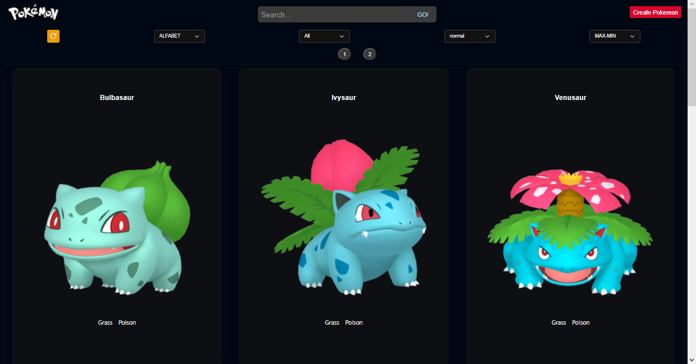
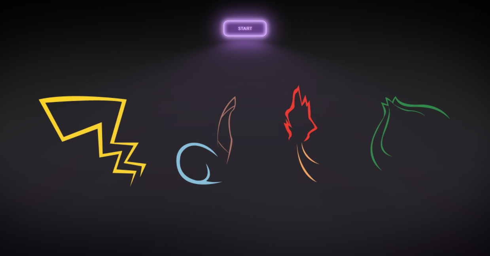

<h1 align="center">Hi 👋, I'm Carlos Diaz</h1>
<h3 align="center">I am a 20-year-old Venezuelan lover of video games and technology. I am currently focused on full stack web development, systems, AGILE methodologies, digital transformation and learning new technologies to exploit them. Last year 2021, I rediscovered my passion for programming and I am finishing my course at Bootcamp Henry to obtain my full stack web developer certification, I want to share my skills with you. Welcome!!</h3>

```javascript
const aboutMe = {
   code: [Javascript, Typescript, HTML, CSS],
   technologies: {
      frontEnd: {
         js: ["React", "Redux"],
         css: ["Bootstrap"]
      },
      backEnd: {
         js: ["Node", "Express"]
      },
      databases: ["PostgreSQL"],
   },
};
```
<<<<<<< HEAD

=======
>>>>>>> be1e4cb6783d5c5f12cd5f68731b4cc84f1390a4

- 💬 Ask me about **JavaScript, React, Redux, HTML, CSS, Node JS, Express, PostgreSQL, TypeScript, Sequelize**

- 📫 How to reach me **carlosrdf45@gmail.com**


- ⚡ Fun fact **After many hours of writing code, I enter a state called "dumb time" which consists of an abstract state of constant illogical thinking talking to my brain about everything and nothing.**

<h3 align="left">Connect with me:</h3>
<p align="left">
<a href="https://www.linkedin.com/in/carlos13df/" target="_blank"></a>
</p>

<h3 align="left">Languages and Tools:</h3>
<p align="left">  <a href="https://developer.mozilla.org/en-US/docs/Web/JavaScript" target="_blank">  </a> 
<a href="https://www.w3.org/html/" target="_blank">  </a>
<a href="https://www.w3schools.com/css/" target="_blank">  </a> 
<a href="https://getbootstrap.com" target="_blank">  </a> 
<a href="https://reactjs.org/" target="_blank">  </a> 
<a href="https://reactnative.dev/" target="_blank">  </a> 
<a href="https://redux.js.org" target="_blank">  </a>
<a href="https://nodejs.org" target="_blank">  </a>
<a href="https://expressjs.com" target="_blank">  </a> 
<a href="https://git-scm.com/" target="_blank">  </a> 
<a href="https://www.postgresql.org" target="_blank">  </a> 
<a href="https://postman.com" target="_blank">  </a> 
<a href="https://www.typescriptlang.org/" target="_blank">  </a>

<p></p>
</br>
</br>
</br>
 <p border-radius= 100px>  </p>
 
  <div align="center"> 
 <h1>📌My Projects</h1>
  </div>

<br />
  <h2>Pokemon-App</h2>
  <h3> Used technology: <a href= https://github.com/Carlos13-Lab?tab=repositories&q=&type=&language=javascript&sort= >  </a>  <a href= https://github.com/albamarfdc?tab=repositories&q=&type=&language=nodejs&sort= >  </a> <a href= https://github.com/albamarfdc?tab=repositories&q=&type=&language=express&sort= >  </a>
<a href= https://github.com/Carlos13-Lab?tab=repositories&q=&type=&language=postman&sort= >  </a>
<a href= https://github.com/Carlos13-Lab?tab=repositories&q=&type=&language=postgresql&sort= >  </a>
<a href= https://github.com/Carlos13-Lab?tab=repositories&q=&type=&language=reactjs&sort= >  </a>
<a href= https://github.com/Carlos13-Lab?tab=repositories&q=&type=&language=redux&sort= >  </a>
  <a href= https://github.com/Carlos13-Lab?tab=repositories&q=&type=&language=css&sort= >  </a></h3>
  
  
  <div>
  
  
  </div>

  <br />
  <h2>Food-App</h2>
  <h3> Used technology: <a href= https://github.com/Carlos13-Lab?tab=repositories&q=&type=&language=javascript&sort= >  </a>  <a href= https://github.com/albamarfdc?tab=repositories&q=&type=&language=nodejs&sort= >  </a> <a href= https://github.com/albamarfdc?tab=repositories&q=&type=&language=express&sort= >  </a>
<a href= https://github.com/Carlos13-Lab?tab=repositories&q=&type=&language=postman&sort= >  </a>
<a href= https://github.com/Carlos13-Lab?tab=repositories&q=&type=&language=postgresql&sort= >  </a>
<a href= https://github.com/Carlos13-Lab?tab=repositories&q=&type=&language=reactjs&sort= >  </a>
<a href= https://github.com/Carlos13-Lab?tab=repositories&q=&type=&language=redux&sort= >  </a>
  <a href= https://github.com/Carlos13-Lab?tab=repositories&q=&type=&language=css&sort= >  </a></h3>
  
  <div>
  
  
  </div>

